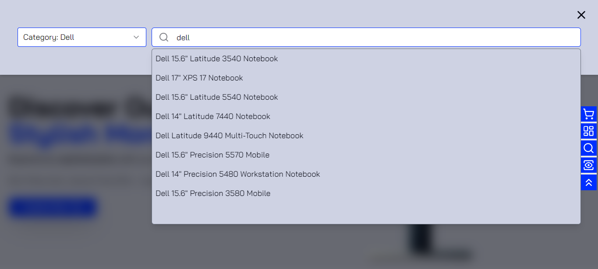

# Electra

## Table of Contents
- [Introduction](#introduction)
- [Features](#features)
- [Technology Stack](#technology-stack)
- [Screenshots](#screenshots)
- [Contact](#contact)

## Introduction
Electra is an advanced online shopping platform specializing in cameras, laptops, and monitors. Built with Next.js, React Query, Redux Toolkit, and other modern technologies, Electra provides users with a smooth and enjoyable shopping experience. Whether you're looking for the latest camera, a high-performance laptop, or a top-quality monitor, Electra has you covered.

## Features

### Explore Electra
- **Add to Cart**: Seamlessly add items to your cart for a streamlined shopping experience.
- **Add to Wishlist**: Save your favorite items for later with the wishlist feature.
- **Authentication**: Secure and easy user authentication with Clerk.
- **Profile Management**: Update your profile, including image uploads, with robust validation.
- **Search Functionality**: Enjoy an intelligent search function with auto-suggestions based on your input.
- **Product Detail Viewing**: Get detailed information about each product.
- **Product Quick View**: Quickly view essential product details without leaving the current page.
- **Dashboard**: Manage your orders, cart, and wishlist from a centralized dashboard.
- **Stripe Payment**: Secure online payments through Stripe.
- **Responsive Design**: Fully responsive design, including a dark mode switch for a better user experience.
- **Newsletter**: Stay updated with the latest news and offers by subscribing to our newsletter.
- **Contact Page**: Reach out to us with any questions or feedback.
- **Sorting**: Sort products by various criteria to find exactly what you need.
- **Infinite Scroll**: Enjoy a seamless browsing experience with infinite scroll.

## Technology Stack
- **Frontend**: Next.js, React, Typescript, TailwindCSS, Shadcn
- **State Management**: Redux Toolkit, React Query
- **Forms**: React Hook Form
- **Authentication**: Clerk
- **Database**: MongoDB
- **Payments**: Stripe
- **Other**: Axios (for API requests)

## Screenshots

## Contact
If you want to contact me, you can reach me at kendrickoppong94@gmail.com.
